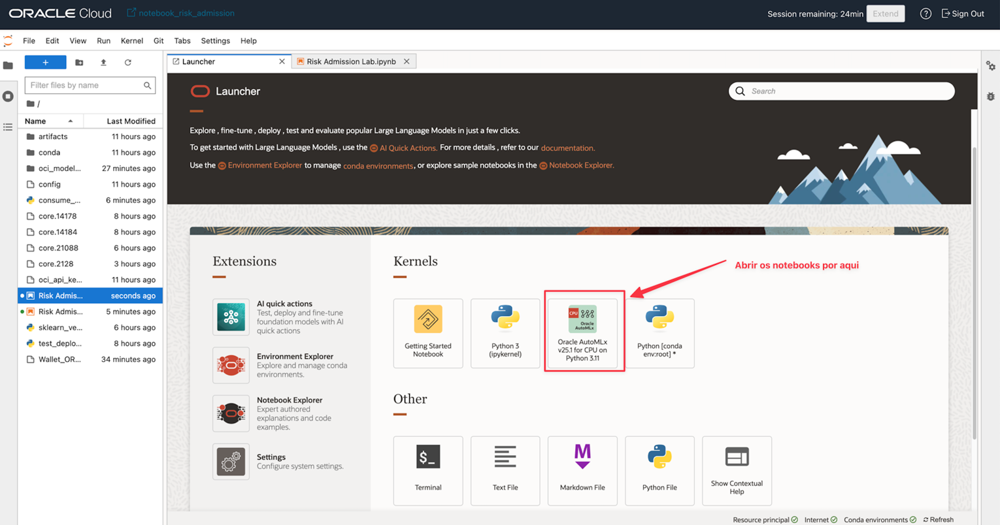
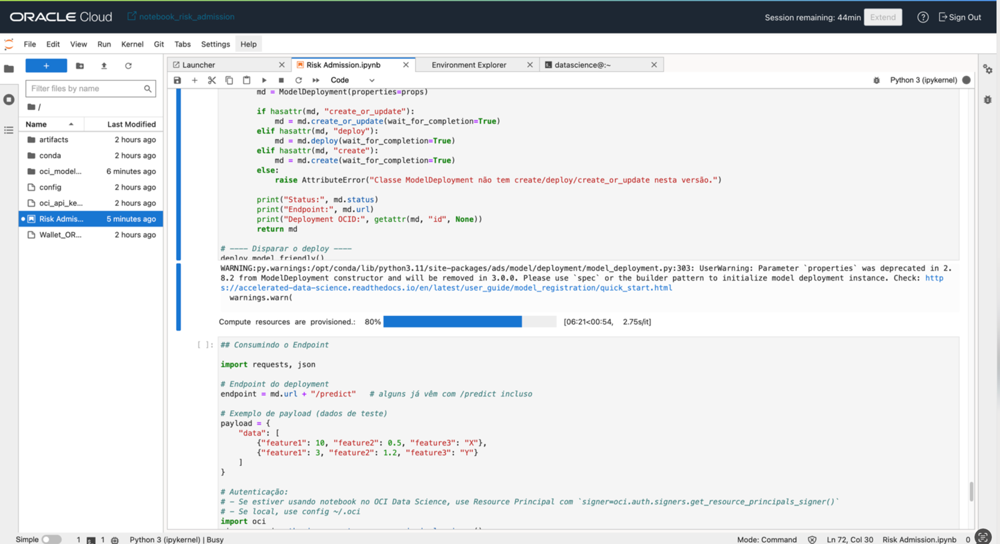
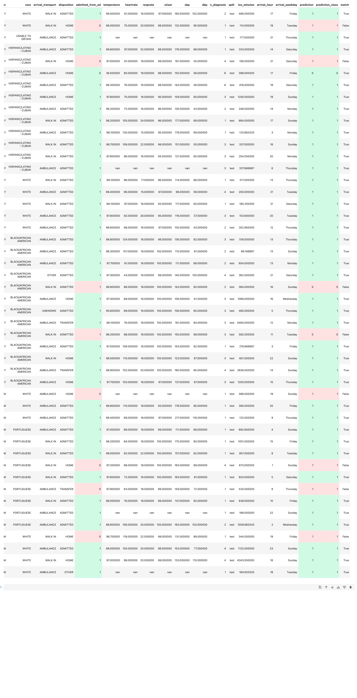

# Hospital Risk Admission Prediction with Machine Learning

## Introdução

Organizações de saúde enfrentam grandes desafios para prever o risco de internação hospitalar de pacientes atendidos no pronto-socorro.
Normalmente, os médicos e equipes de triagem precisam tomar decisões rápidas com base em informações incompletas, o que pode levar a:

•	Subutilização ou sobrecarga de leitos.

•	Internações desnecessárias que aumentam custos.

•	Altos riscos para pacientes que deveriam ser internados mas acabam sendo liberados.

Essas dificuldades impactam a eficiência hospitalar e a qualidade do atendimento ao paciente.

## Caso de Uso

Este material apresenta um fluxo de ciência de dados completo para prever risco de internação em ambiente hospitalar.
Ele combina preparação de dados, treinamento de modelo preditivo e implantação em ambiente de produção.
O modelo pode ser integrado a sistemas clínicos para fornecer insights em tempo real, auxiliando equipes médicas e administrativas na tomada de decisão.

### Objetivos e Benefícios

•	Apoiar decisões clínicas: fornecer uma previsão sobre o risco de internação de um paciente no momento da admissão.

•	Otimizar recursos hospitalares: uso mais inteligente de leitos, equipamentos e equipe médica.

•	Reduzir custos: evitar internações desnecessárias.

•	Aprimorar qualidade do atendimento: aumentar a precisão das decisões médicas e a segurança do paciente.

•	Acelerar inovação em saúde: demonstrar como inteligência artificial pode ser aplicada a processos críticos do setor.

## Dados para Treinamento

Para que o treinamento pudesse ter validação, foram utilizados dados da **PhysioNet**, pois trata-se de um banco de dados público do **Beth Israel Deaconess Medical Center**.
Mais detalhes podem ser obtidos aqui: [MIMIC-IV-ED Demo](https://physionet.org/content/mimic-iv-ed-demo/2.2/)

Abaixo, segue a estrutura de dados utilizada para o treinamento de Machine Learning.

### Estrutura dos Dados

- **Identificação:**

    - subject_id → ID do paciente

    - hadm_id → ID da admissão hospitalar (pode estar ausente em não admitidos)

    - stay_id → ID da estadia no pronto-socorro

- **Datas e horários:**

    - intime → horário de entrada no pronto-socorro

    - outtime → horário de saída

- **Demografia:**

    - gender → sexo (M/F)

    - race → raça/etnia

- **Chegada e saída:**

    - arrival_transport → forma de chegada (ex.: ambulância, caminhada)

    - disposition → destino após o atendimento (ex.: ADMITTED, HOME)

    - admitted_from_ed → se foi admitido no hospital a partir do pronto-socorro (0 = não, 1 = sim)

- **Sinais vitais na entrada:**

    - temperature → temperatura corporal (°F)

    - heartrate → frequência cardíaca

    - resprate → frequência respiratória

    - o2sat → saturação de oxigênio

    - sbp → pressão arterial sistólica

    - dbp → pressão arterial diastólica

- **Outros:**

    - n_diagnosis → número de diagnósticos registrados

    - split → particionamento dos dados (train, val, possivelmente test)

## Oracle Cloud Data Science

O laboratório foi construído para ser executado no Oracle Cloud Data Science, ambiente colaborativo que oferece:

•	Notebooks Jupyter integrados com bibliotecas modernas de machine learning.

•	Gestão de experimentos para versionamento e rastreabilidade de modelos.

•	Integração com Oracle Autonomous Database e outros serviços da Oracle Cloud.

•	Model Deployment gerenciado, que disponibiliza modelos como APIs REST de alta disponibilidade.

Isso permite que o modelo de previsão de risco de internação seja colocado em produção de forma simples e segura, pronto para ser consumido por aplicações externas ou fluxos de trabalho corporativos.

## Execução

O material foi desenhado para ser rodado diretamente no serviço Oracle Cloud Data Science.
Ao final da execução, o pipeline gera um deployment do modelo que pode ser utilizado de forma geral, servindo predições via API para qualquer aplicação de negócio ou sistema hospitalar.

Você pode baixar o material aqui: [Risk Admission Lab v1](./Risk%20Admission%20Lab%20v1.ipynb)

O material em anexo está no formato **Jupyter Lab** e o documento é auto-explicativo em sua execução.
Trata-se de um material:

- Que ajuda a buscar a informação para treinamento a partir de um **Object Storage** ou **Oracle Autonomous Database**
- Avalia as informações, ajudando na verificação e manipulação
- Executa o treinamento de Machine Learning
- Monta a estrutura do Modelo e faz o deployment, expondo um endpoint para consumo
- Executa um código de exemplo que pode ser utilizado para o consumo da API

## Reference

- [A Data Scientist's Guide to OCI](https://docs.oracle.com/en-us/iaas/Content/GSG/Reference/getting-started-as-data-scientist.htm#ml-lifecycle-data)
- [Download Database Connection Information](https://docs.oracle.com/en/cloud/paas/autonomous-database/serverless/adbsb/connect-download-wallet.html#GUID-DED75E69-C303-409D-9128-5E10ADD47A35)
- [ADS Training](https://accelerated-data-science.readthedocs.io/en/latest/user_guide/model_training/automl/quick_start.html)

## Acknowledgments

- **Author** - Cristiano Hoshikawa (Oracle LAD A-Team Solution Engineer)